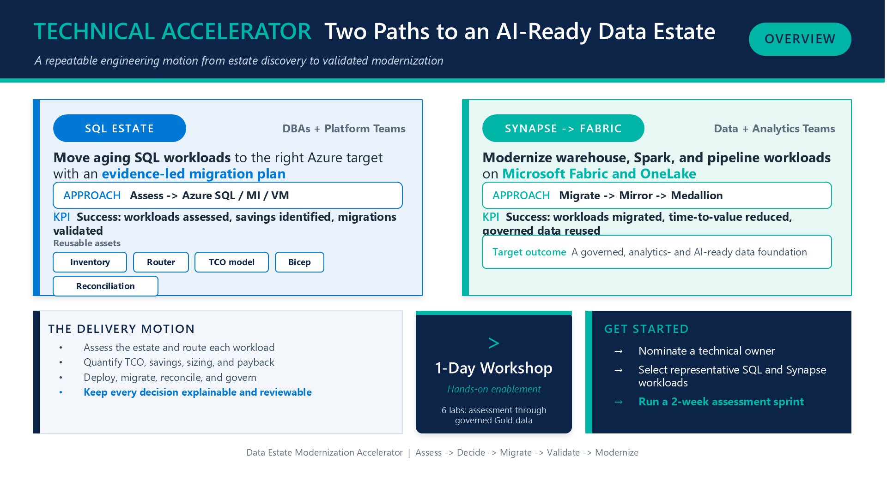

# Data Estate Modernization Accelerator

[](LICENSE)
[](https://www.python.org/)
[](https://learn.microsoft.com/fabric/)

An opinionated, industry-agnostic toolkit for moving data estates from discovery to a validated Azure and Microsoft Fabric modernization plan.

The accelerator turns a complex modernization program into an explainable workflow:

> Assess -> Decide -> Build the business case -> Migrate -> Validate -> Modernize

It supports two common transformation motions:

- **Synapse to Microsoft Fabric** for warehouses, Spark workloads, and data pipelines.
- **SQL estate acceleration** for renewal planning, on-premises SQL migration to Azure, and mirroring into OneLake.

## Why teams use it

Modernization programs often stall between technical discovery and an actionable migration decision. This repository provides reusable engineering assets for each stage:

| Capability | Outcome |
|---|---|
| Estate assessment | Consistent workload inventory captured with a read-only T-SQL script |
| Decision support | Transparent, rules-based target recommendations with documented trade-offs |
| Business case | Editable Excel model for SQL TCO and Synapse-to-Fabric scenarios |
| Landing zone | Bicep starter for Fabric capacity and an Entra-only Azure SQL server |
| Migration execution | Practical runbooks for SQL-to-Azure and Synapse-to-Fabric paths |
| Validation | Repeatable row-count, checksum, and timing reconciliation |
| Modernization | OneLake mirroring, medallion architecture, and governance guidance |
| Enablement | Workshop and one-page materials for delivery and partner teams |

## Architecture and workflow

```text
SQL Server / Synapse
         |
         v
  [1. Assess estate] -----> Inventory CSV
         |
         v
  [2. Route workloads] ---> Recommended targets + rationale
         |
         v
  [3. Model value] -------> TCO, savings, and payback workbook
         |
         v
  [4. Deploy & migrate] --> Fabric capacity / Azure SQL + runbooks
         |
         v
  [5. Validate] ----------> Reconciliation evidence
         |
         v
  [6. Modernize] ---------> OneLake + medallion + governance
```

## Executive overview

[](enablement/data-estate-modernization-overview.pptx)

Use the [editable PowerPoint overview](enablement/data-estate-modernization-overview.pptx) to introduce the two modernization paths, delivery motion, workshop, and recommended next step. The [PNG preview](enablement/assets/data-estate-modernization-overview.png) is ready for sharing in documentation, email, or internal channels.

### Calculator spotlight

[](enablement/business-case-calculator-overview.pptx)

The [editable calculator overview](enablement/business-case-calculator-overview.pptx) explains the SQL and Fabric economic models, their connected inputs, and the illustrative outputs generated by the included workbook. Use the [PNG preview](enablement/assets/business-case-calculator-overview.png) in technical and investment-case conversations.

## Quick start

### Prerequisites

- Python 3.10 or later
- An ODBC Driver for SQL Server when using reconciliation
- Azure CLI and Bicep when deploying the landing-zone starter
- Access to the source environment and a non-production Azure subscription

### 1. Clone and configure

```bash
git clone https://github.com/Haroon921/data-estate-modernization-accelerator.git
cd data-estate-modernization-accelerator

python -m venv .venv
```

Activate the environment:

```powershell
# PowerShell
.\.venv\Scripts\Activate.ps1
```

```bash
# macOS/Linux
source .venv/bin/activate
```

Install dependencies:

```bash
python -m pip install -r requirements.txt
```

### 2. Assess and route workloads

Run `assess/inventory_sql.sql` on each SQL instance using SSMS or `sqlcmd`, then export the result using the schema in `assess/sample_inventory.csv`.

Try the router with the included sample:

```bash
python decide/router.py assess/sample_inventory.csv > routed.csv
```

The output includes the recommended target, rationale, migration watch-outs, and potential OneLake mirroring candidates.

### 3. Build the business case

```bash
python business-case/build_calc.py
```

Open `business-case/modernization_business_case.xlsx` and replace the yellow placeholder inputs with validated customer data.

### 4. Deploy the landing-zone starter

Review and replace every sample value in `migrate/main.parameters.json`, then run:

```bash
az deployment group create \
  --resource-group <resource-group> \
  --template-file migrate/main.bicep \
  --parameters migrate/main.parameters.json
```

Continue with the relevant runbook:

- `migrate/runbooks/sql_to_azure.md`
- `migrate/runbooks/synapse_to_fabric.md`

### 5. Validate and modernize

Configure reconciliation as described in `validate/README.md`, then run:

```bash
python validate/reconcile.py config.json
```

Use the assets in `modernize/` to introduce OneLake mirroring, a medallion data model, and a governance baseline.

## Repository structure

```text
.
|-- assess/           # SQL inventory and sample assessment data
|-- business-case/    # Excel business-case generator and workbook
|-- decide/           # Explainable workload routing and decision matrix
|-- enablement/       # Workshop and stakeholder enablement material
|-- migrate/          # Bicep landing zone and migration runbooks
|-- modernize/        # Mirroring, medallion, and governance guidance
|-- validate/         # Source-to-target reconciliation framework
|-- .github/          # CI, issue templates, and pull request template
|-- CONTRIBUTING.md   # Contributor workflow and quality expectations
|-- SECURITY.md       # Responsible vulnerability reporting
`-- LICENSE           # MIT License
```

## Design principles

- **Explainable recommendations:** routing rules are visible, deterministic, and reviewable.
- **Evidence before migration:** assessment, cost assumptions, and validation results are retained as decision records.
- **Secure by default:** the starter uses Entra-only SQL administration, TLS 1.2, and disabled public network access.
- **Human approval:** outputs are accelerators, not substitutes for architecture review or product readiness assessment.
- **Composable assets:** use the full workflow or adopt only the stage your delivery team needs.

## Production readiness

This repository is a starting point, not a production deployment package. Before customer or production use:

- Verify current Azure and Fabric pricing, quotas, regions, API versions, and feature support.
- Replace all sample names, identifiers, sizing assumptions, and prices.
- Run Azure Migrate, Data Migration Assistant, Fabric Capacity Metrics, and workload-specific compatibility checks as appropriate.
- Review networking, private endpoints, identity, backup, disaster recovery, monitoring, and regulatory requirements.
- Test migration and rollback procedures against representative non-production workloads.

## Contributing

Contributions from architects, data engineers, database specialists, and delivery teams are welcome. Start with [CONTRIBUTING.md](CONTRIBUTING.md), use the issue templates, and keep recommendations traceable to reproducible evidence or official documentation.

For support and vulnerability reporting, see [SUPPORT.md](SUPPORT.md) and [SECURITY.md](SECURITY.md).

## License

Licensed under the [MIT License](LICENSE).

## Disclaimer

This is a community accelerator and is not an official Microsoft product or support offering. Product capabilities, pricing, and support statements change over time; verify all assumptions against current Microsoft documentation before making production or customer commitments.
