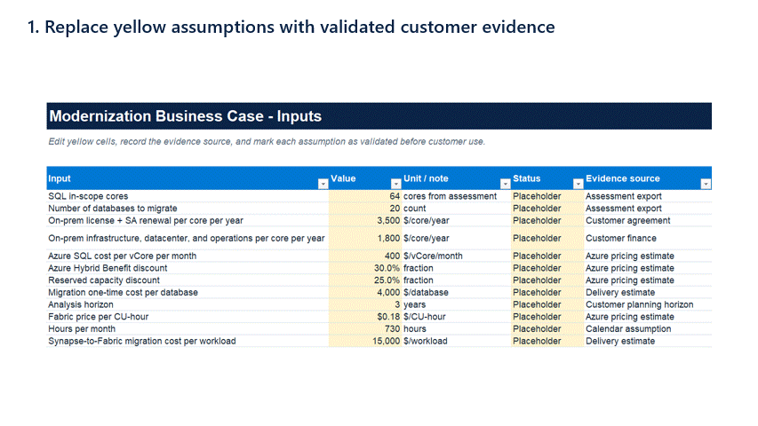

# Business-Case Calculator

The calculator turns technical assessment inputs into an editable modernization investment case for:

- SQL Server renewal versus migration to Azure SQL.
- Synapse workload migration to Microsoft Fabric.
- Downside, base, and upside sensitivity scenarios.

Download the latest generated workbook from the repository or from the current GitHub release.

## Walkthrough



For full-size screenshots and explanations, see the [calculator walkthrough](../docs/calculator-walkthrough.md).

## Worksheets

| Worksheet | Purpose |
|---|---|
| `Summary` | Executive savings, investment, payback, annual-savings chart, and cumulative SQL cost chart |
| `Inputs` | Customer assumptions, validation status, units, and evidence sources |
| `SQL_TCO` | SQL renewal-versus-migration calculations |
| `Fabric_SKUs` | Fabric Capacity Unit reference table |
| `Synapse_to_Fabric` | Workload-level SKU, utilization, cost, and savings model |
| `Sensitivity` | Downside, base, and upside investment scenarios |

## Generate the workbook

From the repository root:

```bash
python -m pip install -r requirements.txt
python business-case/build_calc.py
```

The generator writes `business-case/modernization_business_case.xlsx`.

## Use the model responsibly

1. Replace every yellow input with customer-specific evidence.
2. Change each input status from `Placeholder` to `Validated`.
3. Verify current Azure and Microsoft Fabric pricing.
4. Review sizing, migration effort, and support assumptions with engineering.
5. Review the final scenario with the customer's finance stakeholders.

The default values are illustrative and must not be presented as a customer quote or production sizing recommendation.
