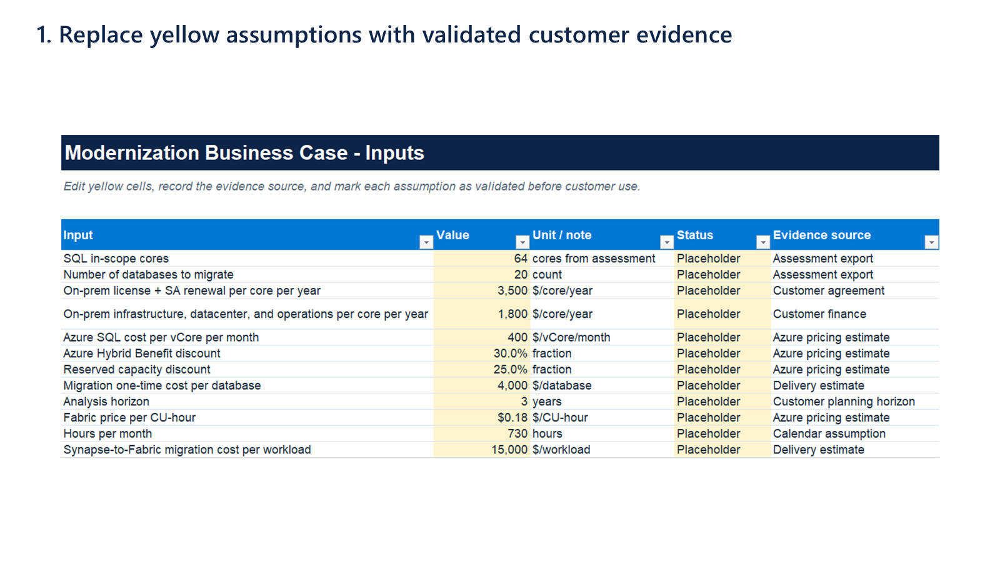
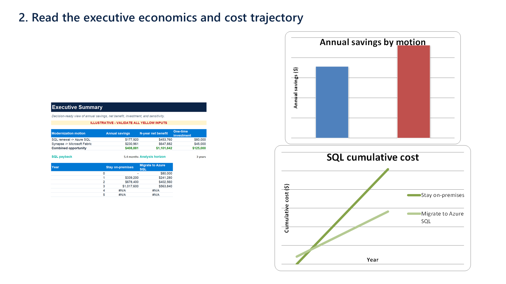
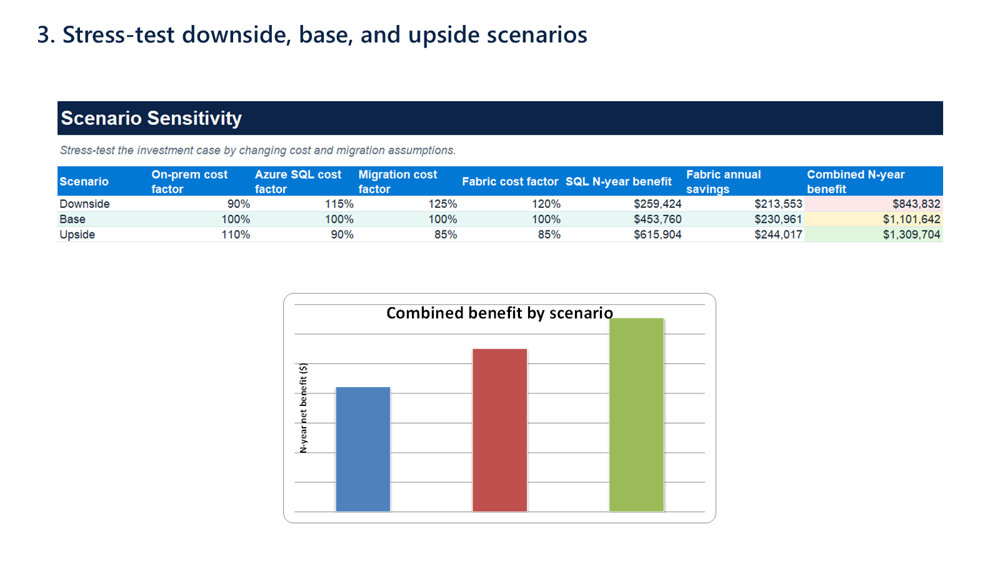

# Business-Case Calculator Walkthrough

The workbook connects technical discovery to an investment conversation in three steps.

> All screenshots use illustrative sample data. Replace every yellow input and verify current pricing before customer use.

## 1. Establish validated assumptions

Use the `Inputs` worksheet to capture the estate size, current operating cost, Azure benefits, migration investment, analysis horizon, and Fabric pricing. Each assumption includes:

- A unit or interpretation.
- A validation status.
- The expected source of evidence.

The Summary worksheet remains visibly marked as illustrative while any input is still labeled `Placeholder`.

## 2. Read the executive economics

The `Summary` worksheet combines the SQL and Fabric motions into:

- Annual run-rate savings.
- N-year net benefit.
- One-time migration investment.
- SQL payback period.
- Annual savings by modernization motion.
- Cumulative stay-versus-migrate cost.

## 3. Stress-test the investment case

The `Sensitivity` worksheet changes four drivers across downside, base, and upside cases:

- On-premises cost.
- Azure SQL cost.
- Migration cost.
- Fabric capacity cost.

The resulting chart makes the range of potential N-year benefit visible without hiding the assumptions behind the outcome.

## Share the walkthrough

- [Animated GIF](assets/calculator/calculator-walkthrough.gif)
- [Editable PowerPoint walkthrough](../enablement/calculator-walkthrough.pptx)
- [Generated Excel workbook](../business-case/modernization_business_case.xlsx)
