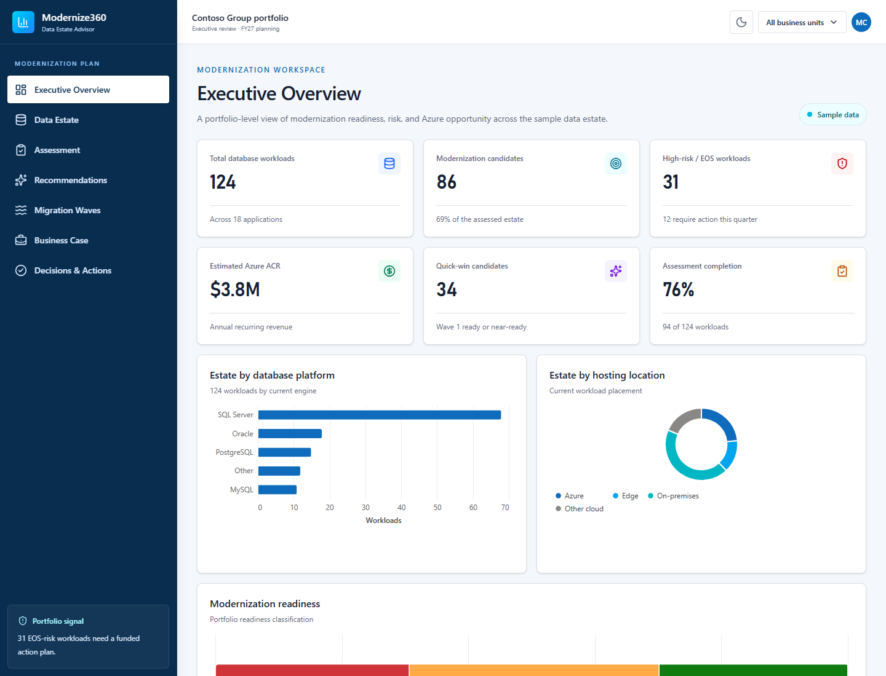

# Modernize360

Modernize360 is a Microsoft Fabric App for data-estate modernization planning. It gives customer and partner teams a single, decision-oriented workspace for assessing database workloads, selecting target platforms, sequencing migration waves, and building an executive business case.

> This first iteration uses clearly labelled, realistic sample data so the complete experience can be reviewed before production data is connected.



## Experience

- **Executive Overview** — portfolio KPIs, platform distribution, hosting footprint, readiness, target recommendations, and wave distribution.
- **Data Estate** — searchable and filterable workload inventory covering platform, version, hosting, size, criticality, EOS risk, Azure state, and assessment status.
- **Assessment** — compatibility, complexity, dependencies, blockers, readiness scoring, and migration pattern.
- **Recommendations** — evidence-led platform recommendations with rationale, business benefit, technical considerations, and confidence.
- **Migration Waves** — quick wins, moderate-complexity workloads, and strategic migrations organized into executable waves.
- **Business Case** — Azure ACR opportunity, modernization coverage, partner services value, risk reduction, and wave value.
- **Decisions & Actions** — accountable decision records with rationale, owner, status, and next action.

## Recommended targets represented

- Azure SQL Database
- Azure SQL Managed Instance
- SQL Server on Azure VM
- SQL Server on Azure Local
- SQL Database in Microsoft Fabric
- Retain / optimize

## Technology

- React 19 and TypeScript
- Vite
- Tailwind CSS 4
- Microsoft Rayfin authentication and static hosting
- Microsoft Fabric Visuals / Vega-Lite
- Vitest and Testing Library

The existing Rayfin authentication gate and protected static-hosting posture are preserved. Password authentication remains disabled.

## Local development

### Prerequisites

- Node.js and npm
- Access to Microsoft Fabric
- Rayfin CLI authentication for local sign-in

### Run

```powershell
npm install
npm run dev
```

Open `http://localhost:5173`. If required, authenticate first:

```powershell
npx rayfin login
```

## Validation

```powershell
npm run typecheck
npm run build
npm run lint
npm test
npm run validate:visual:preview
```

The visual preview validator is used because the dashboard specifications are runtime TypeScript objects. Browser validation confirms that the resulting charts render in the authenticated local app.

## Project structure

```text
.
├── docs/                         # Product screenshots
├── packages/
│   ├── data/                     # Rayfin data package
│   ├── frontend/                 # React application
│   └── shared/                   # Shared contracts
├── rayfin/
│   └── rayfin.yml                # Rayfin service configuration
├── package.json                  # Workspace commands
└── tsconfig.json                 # TypeScript project references
```

## Current data posture

All values shown in this iteration are illustrative sample data. They must not be treated as a production migration assessment, commercial quote, or committed Azure consumption forecast.

## Deployment

The app has **not** been deployed as part of this implementation. Review the sample experience and select the target Fabric workspace before running any Rayfin deployment command.
